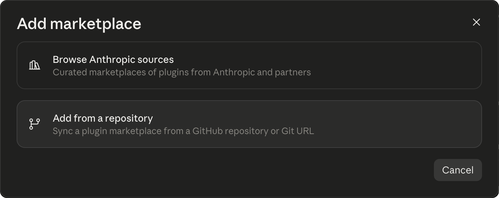

<p align="center">
  
</p>

<h1 align="center">Vayaan Labs plugins</h1>

<p align="center"><b>Vayaan Labs plugins for coding agents: add the catalogue once, then install any of our plugins by name and keep it updated.</b></p>

<p align="center">
  <a href="#get-started"><b>Add the catalogue</b></a> · <a href="#plugins">Plugins</a> · <a href="https://github.com/vayaan-labs/plugins/issues">Report a bug</a>
</p>

<p align="center">
  <a href="https://github.com/vayaan-labs/plugins/actions/workflows/ci.yml"></a>
  
  <a href="LICENSE"></a>
  <a href="https://github.com/vayaan-labs/plugins/stargazers"></a>
</p>

This catalogue is a list your coding agent reads so you can install our plugins by name instead of hunting down each repository. Claude Code and Codex call a catalogue like this a marketplace. Each plugin says which agent it runs in; today that is Claude Code.

## Plugins

<table>
<thead><tr><th>Plugin</th><th>What it does</th><th>Runs in</th><th>Install</th></tr></thead>
<tbody>
<tr>
<td nowrap><a href="https://github.com/vayaan-labs/cache-maxxer">Cache Maxxer</a></td>
<td>Keeps your cache warm, so you pay 96% less to re-read your conversation. Shows the time left on the cache and your hit rate, and explains every rebuild.</td>
<td>Claude Code, terminal and desktop app</td>
<td nowrap><samp>cache-maxxer@vayaan-labs</samp></td>
</tr>
</tbody>
</table>

<p align="center">
  
</p>
<p align="center"><i>Cache Maxxer in the Claude desktop app.</i></p>

<p align="center">
  
</p>
<p align="center"><i>And in a terminal.</i></p>

## Get started

1. **Add the catalogue.** In the Claude desktop app, open the Directory, choose Plugins, press + and choose Add marketplace, then Add from a repository, and enter `vayaan-labs/plugins`.

   

   In a terminal:

   ```
   claude plugin marketplace add vayaan-labs/plugins
   ```

2. **Install a plugin.** In the app, open the Vayaan Labs catalogue under Plugins and install it there. In a terminal, use its name from the table:

   ```
   claude plugin install cache-maxxer@vayaan-labs
   ```

3. **Reload if needed.** If Claude Code was already open, run `/reload-plugins`. Each plugin's page, linked in the table, says what to look for.

Or paste this prompt to your agent:

```
Add the Vayaan Labs plugin catalogue to Claude Code
(https://github.com/vayaan-labs/plugins).
Run this command:
claude plugin marketplace add vayaan-labs/plugins
Check that `claude plugin marketplace list`
shows vayaan-labs, then tell me which plugins
it offers. After I choose a plugin, install it
and tell me to run /reload-plugins.
```

Update with `claude plugin marketplace update vayaan-labs`, then `claude plugin update <plugin>@vayaan-labs`, and run `/reload-plugins`, or tell your agent:

```
Update the vayaan-labs marketplace and every
plugin I installed from it, then tell me to
run /reload-plugins.
```

Remove a plugin with `claude plugin uninstall <plugin>@vayaan-labs`, or the whole catalogue with `claude plugin marketplace remove vayaan-labs`, or tell your agent:

```
Uninstall <plugin name>, then tell me to run
/reload-plugins.
```

```
Remove the vayaan-labs marketplace, then tell
me to run /reload-plugins.
```

## Privacy

The catalogue is one file, `.claude-plugin/marketplace.json`, naming each plugin and the GitHub repository its code lives in. It has no server and runs nothing. Claude Code fetches it from GitHub when you add or update the catalogue, and fetches a plugin's repository when you install it. What a plugin does once installed is on its own page.

## Contributing

Found a problem with the catalogue? Open an issue. A problem with a plugin belongs in that plugin's own repository. Check a change to the catalogue with:

```
claude plugin validate --strict .claude-plugin/marketplace.json
```

To report a security problem privately, see [SECURITY.md](SECURITY.md).

## Licence

MIT. Built by [@YaanFPV](https://github.com/YaanFPV).
